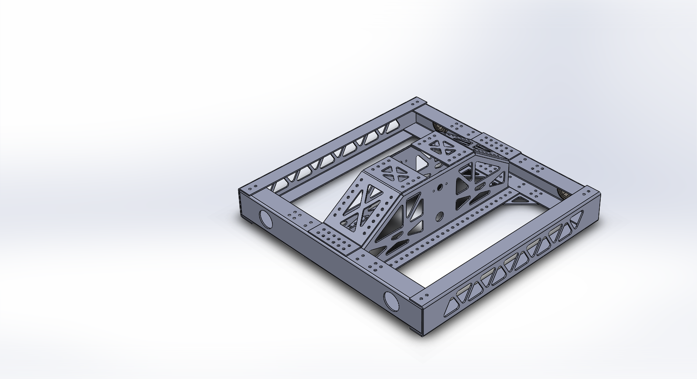

# RobotOpen-H-Drive
Based on RobotOpen

### RobotOpen 
http://www.team221.com/robotopen/index.html

### RobotOpen library 
https://github.com/221robotics/RobotOpen-HA-Library

### If you need some help with definition 
https://robotopen.readthedocs.io/en/latest/classes/robotopen.html

## Code
This code can run on Arduino Uno/Mega 2560  
But if you want to running this code on "Arduino Uno" make sure the I/O is right!! 

## The latest update
add W_light code(if you want use this feature you might need Arduino Nano to control the light)
The led pin is 33(if you want to run this code on "Arduino Uno" make sure the I/O is right!!)

### Add Arduino Nano in the system
will update the Arduino Nano code later(The Arduino Nano will control all LEDs on the robot)

### If you want to change you IP address you can change in library "RobotOpenHA.cpp"
I don't know why I can't change in the code(Maybe I will rewrite later)

### This code not finish yet.. But it can run.. 

## 20201203 update

Redesign the detail of the Drivetrain. Allow much easier to assembly.

Will Finish all detail at August 10.

## Drivetrain Image

The drivetrain will finish and release at August 15. 

## 